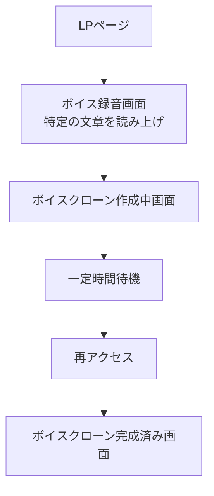
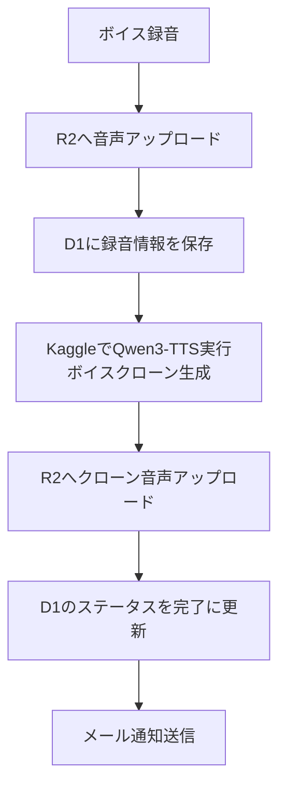

# 🎙️ こんなの作ろうとおもっている

## 画面の流れ



---

## 処理の流れ



---

## JWTログインの試し方

`/api/auth/login` は D1 の `users` テーブルを見て、bcrypt でパスワード照合します。

### 1. テーブルを作る

```bash
wrangler d1 execute voice-clone --local --file=db/migrate/20260406204200_create_users.sql
```

リモートに作る場合:

```bash
wrangler d1 execute voice-clone --remote --file=db/migrate/20260406204200_create_users.sql
```

### 2. ユーザーを作る

ローカル DB に作る場合:

```bash
pnpm create:user --email demo@example.com --password password --name "Demo User"
```

リモート DB に作る場合:

```bash
pnpm create:user --email admin@example.com --password password --role admin --remote
```

SQL だけ確認したい場合:

```bash
pnpm create:user --email demo@example.com --password password --dry-run
```

### 3. ログイン API を叩く

```bash
curl -i -X POST http://localhost:3000/api/auth/login \
  -H 'content-type: application/json' \
  -d '{"email":"demo@example.com","password":"password"}'
```

`JWT_SECRET` を設定していない場合は開発用のデフォルト値で署名します。本番では必ず `JWT_SECRET` を設定してください。
