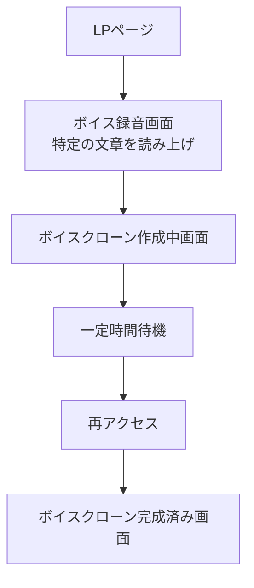
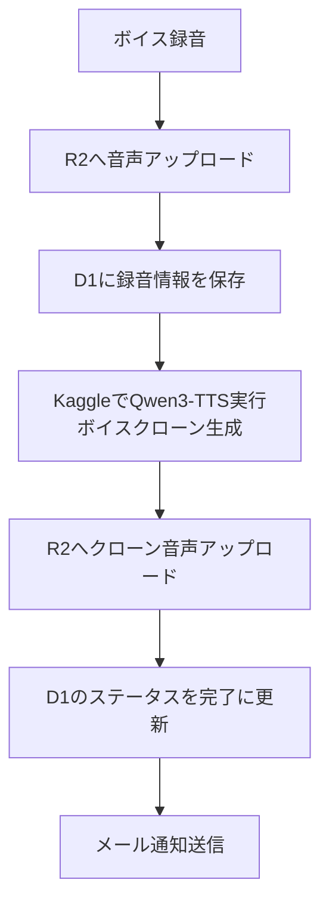

# 🎙️ こんなの作ろうとおもっている

## 画面の流れ

```mermaid
flowchart TD
    LP[LPページ] --> REC[ボイス録音画面<br/>特定の文章を読み上げ]
    REC --> LOADING[ボイスクローン作成中画面]
    LOADING --> WAIT[一定時間待機]
    WAIT --> CHECK[再アクセス]
    CHECK --> DONE[ボイスクローン完成済み画面]
```

---

## 処理の流れ

```mermaid
flowchart TD
    REC[ボイス録音]
        --> R2_UPLOAD[R2へ音声アップロード]

    R2_UPLOAD
        --> D1_SAVE[D1に録音情報を保存]

    D1_SAVE
        --> KAGGLE[KaggleでQwen3-TTS実行<br/>ボイスクローン生成]

    KAGGLE
        --> R2_CLONE[R2へクローン音声アップロード]

    R2_CLONE
        --> D1_UPDATE[D1のステータスを完了に更新]

    D1_UPDATE
        --> MAIL[メール通知送信]
```
